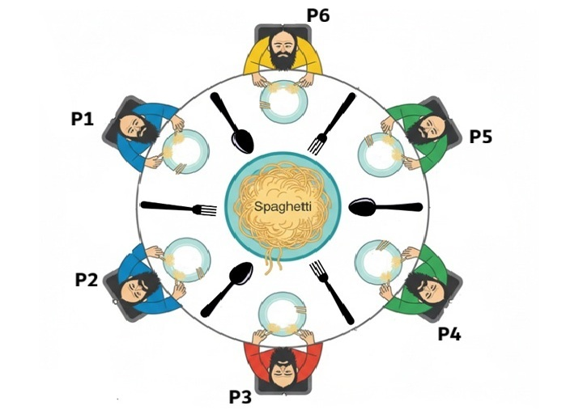

*This project has been created as part of the 42 curriculum by anasimi.*

# Philosophers

A multithreaded implementation of the Dining Philosophers problem in C using POSIX threads and mutexes.

## Description

The goal of this project is to explore concurrent programming, thread synchronization, and resource sharing.

A group of philosophers sit around a circular table and repeatedly eat, sleep, and think. Between each pair of philosophers lies a fork. To eat, a philosopher must acquire both the fork on the left and the fork on the right. Since forks are shared resources, access must be synchronized to prevent race conditions and ensure the correctness of the simulation.

The challenge is to coordinate multiple threads while avoiding deadlocks, minimizing starvation, and respecting strict timing constraints.

## Illustration

<p align="center">
  
</p>

## Implementation

The mandatory part represents each philosopher as an independent thread.

Each fork is protected by a mutex, guaranteeing exclusive access to the resource. The simulation continuously monitors the state of every philosopher and detects starvation according to the timing parameters provided at launch.

The implementation focuses on:

* Thread creation and management
* Mutex synchronization
* Shared resource protection
* Starvation detection
* Deadlock prevention
* Accurate time management
* Race-condition-free execution


## Algorithm

The simulation is concurrent. Each philosopher is represented by one thread, and all philosopher threads run at the same time.

Each philosopher repeatedly follows this cycle:

```text
take forks → eat → release forks → sleep → think
```

Forks are the main shared resources. There is one fork between each pair of philosophers, and each fork is protected by one mutex.

```text
1 fork = 1 mutex
```

A philosopher can eat only when they successfully lock both fork mutexes: the fork on their left and the fork on their right. While a philosopher holds a fork, no neighboring philosopher can take that same fork.

This means neighboring philosophers cannot eat at the same time because they share one fork. However, non-neighboring philosophers can eat at the same time because they do not use the same forks.

Example with 5 philosophers:

```text
P1 uses F1 + F5
P2 uses F1 + F2
P3 uses F2 + F3
P4 uses F3 + F4
P5 uses F4 + F5
```

So `P1` and `P2` cannot eat together because both need `F1`, but `P1` and `P3` can eat together because they do not share forks.

To avoid deadlock, philosophers do not all take forks in the same order. Odd philosophers take the left fork first, then the right fork. Even philosophers take the right fork first, then the left fork.

```text
Odd philosophers  → left fork, then right fork
Even philosophers → right fork, then left fork
```

This breaks the circular waiting situation where every philosopher takes one fork and waits forever for the second one.

A monitor continuously checks the state of the simulation. For each philosopher, it compares the current time with the last time the philosopher started eating:

```text
current_time - last_meal > time_to_die
```

If this condition becomes true, the philosopher is considered dead. The monitor prints the death message, sets the shared death flag, and the simulation stops.

If the optional argument `number_of_times_each_philosopher_must_eat` is provided, the monitor also checks whether all philosophers have eaten enough times. If all philosophers reach this number, the simulation stops without any death.

Shared data such as printing, death status, last meal time, and meal counters are protected with mutexes to avoid data races.


The simulation starts by parsing the program arguments and initializing the shared data: philosophers, forks, mutexes, timers, and the optional meal limit.

Each philosopher is then launched as a separate thread. A philosopher repeatedly follows the same routine:

```text
take forks → eat → release forks → sleep → think
```

Before eating, a philosopher must lock both fork mutexes. Once both forks are acquired, the philosopher updates the time of their last meal and starts eating. After eating, the forks are unlocked so that neighboring philosophers can use them.

A separate monitoring loop checks the philosophers during the simulation. If the time since a philosopher’s last meal becomes greater than `time_to_die`, the simulation stops and the death message is printed.

To avoid corrupted output, printing is protected by a mutex. This ensures that two threads cannot write messages at the same time.

The main idea of the algorithm is:

```text
1. Parse and validate arguments
2. Initialize philosophers, forks, and mutexes
3. Create one thread per philosopher
4. Run each philosopher routine in parallel
5. Monitor starvation and meal limits
6. Stop the simulation when a philosopher dies
   or when every philosopher has eaten enough times
7. Join threads and clean allocated resources
```

The synchronization strategy is based on mutexes:

* one mutex for each fork;
* one mutex for printing;
* one mutex for death/status control;
* one mutex for meal-time access.

This prevents data races when several threads access shared resources at the same time.


## Compilation

```bash
make
```

## Usage

```bash
./philo number_of_philosophers time_to_die time_to_eat time_to_sleep [number_of_times_each_philosopher_must_eat]
```

Example:

```bash
./philo 5 800 200 200
```

## Example Output

```text
0   1 has taken a fork
0   1 has taken a fork
0   1 is eating
200 1 is sleeping
400 1 is thinking
```


## Concepts Covered

* Multithreading
* POSIX Threads (`pthread`)
* Mutexes
* Semaphores
* Process Synchronization
* Deadlock Prevention
* Starvation Detection
* Concurrent Programming
* Shared Resource Management
